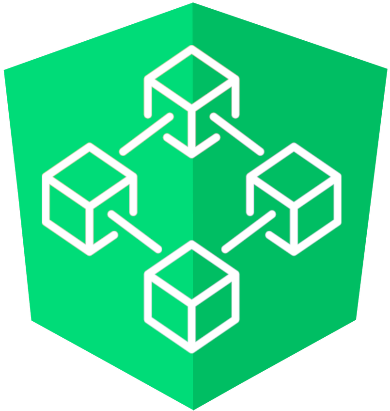
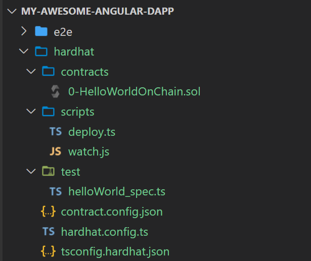
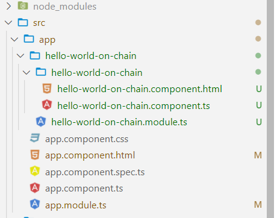
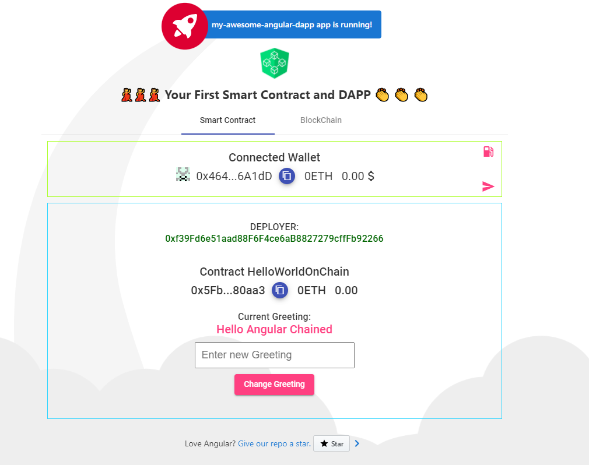
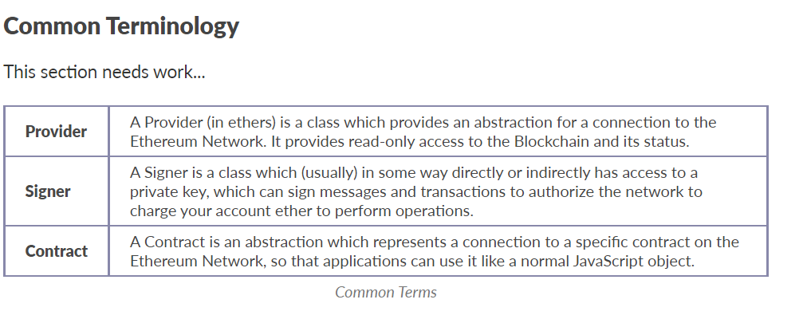

Thanks to  @austingriffith for crafting the awesome [Scaffold-eth](https://github.com/scaffold-eth/scaffold-eth) project. This projects aims to reproduce with angular tooling the same experience as scaffold-sth produce for react devs


# ⛓️  Angullar-Web3


[](https://circleci.com/gh/jdonosocoding/angullar-web3) [](https://circleci.com/gh/jdonosocoding/angullar-web3) [](https://npmjs.com/package/angullar-web3) 
[](/LICENSE) 
<p align="center">
  
</p>


### Mision  
Superpower the angular superdevs with the best and easy to use tools for get up and running instantly creating wonderfull dapps on Ethereum/polygon's blockchains

> everything you need to build on Ethereum and Polygon! 🚀.

🧪 Quickly experiment changing contracts and seen result on the frontend.
&nbsp; 
&nbsp;   
### Main knowledge pillars:
- Hardhat
- Solidity
- Ether.js  
- Of course Angular

&nbsp; 
# ROADMAP

✔️ 10/01/22 First release npm package with min config: version 0.0.1  👏👏👏
  
🚧 15/01/22 Medium article and tutorial  
    (update 13/01/22) ----> 25/01/22 ⏱️⏱️⏱️

✔️ 01/02/22 Release npm package with contract interaction: version 0.0.2   
    (update 13/01/22) ----> 13/01/22 👏👏👏
  
⏱️ 01/02/22 Release npm package with NFT Marketplace interaction: version 0.0.3   

...

01/03/2022 Complete reproduction scaffold-eth as angular schematics: version 1.0.0  

 &nbsp; 


# 🏄‍♂️ Quick Start

Prerequisites: 
To be in an **Angular project** 
  
   ```bash
  ng new angular-scaffold-eth  
``` 
cd in the directory
   ```bash
  cd angular-scaffold-eth  
``` 
 
  &nbsp;  
### 1) Add the angullar-web3 schematics package to your project  

```bash
ng add angullar-web3
```
  &nbsp;  
### 2) chose installation Options:
The package will prompt the options for configuration  
- Project name: if not provided, the angular.json default project will be taken
- Demo Dapp to be installed. The roadmap shows the plan to add additional demo Dapps, for the time being only Hello World Contract and Debug Contract are available
  - Minimal Contract
  - Demo Hello World Contract
  - Demo Debug Contract  
 &nbsp;  

If you choose a Demo app, bear in mind that we use Angular Material for fast mock up, therefore please install angular material for Hello World and Debug Contracts
```bash
  ng add @angular/material
```
  &nbsp;  
### 3) Update tsconfig.json:
Please add following line to the paths property within the tsconfig.json file in the compilerOptions section.
 ```
"paths":{"angullar-web3":["src/app/dapp-injector/index.ts"]}
```
  &nbsp;  

### 4) Initialize your 👷‍ Hardhat chain:
For start up and running we recommend starting learning and playing with the local node. 

&nbsp;**Hardhat file structure**.
The schematics package will scaffold the required hardhat config:  

<p align="center">
  
</p>

It will do the wiring moving the contracts and requiered artifacts as json files to the assets folder.  
In the case that you want to deploy to a testnest or mainnet you can skip the next command.

```javascript
npm run chain  
// spin blockhain node on localhost creating 10 accounts and privatekeys
```
Either deploying to localhost node or testnet/cloud the conract has to be compiled

```javascript
npm run compile 
// compile the demo app contract in hardhat/contracts/demoContract.sol
```
When compiling, the contract artifacts will be created in the angular project assets folder. 


🔏 You can edit your smart contract `.sol` in `/hardhat/contracts` and recompile with same command 

Now is time to deploy our contract

```javascript
npm run deploy
// deploy the smartcontract to the chosen network.
```
 If you want to deploy to a testnet/mainnet the api and private key have to be configured within hardhat/hardhat.config.ts


💼 You can edit your deployment scripts in `/hardhat/deploy`  
 &nbsp;  
 
Developping in the hardhat network it may be useful to use watch hooks for compiling and deploying, if this is required you can avoid the commands 'compile' and 'deploy' and run in watch mode  
```javascript
npm run watch-contract
// launch compile and deploy in watch mode.
```
☠️☠️☠️ Don't do watch mode in mainnet  
⚠️⚠️⚠️ Take care watching in the testnet, test ether is free but you are required to have some  
 &nbsp;  
 **Testing Solidity Contracts**
 The schematics also include the hardhat test configuratio and infrastructure for solidity contract testing  
 &nbsp;


```javascript
npm run contracts:test
// run the contract tests
```
```javascript
npm run contracts:coverage
// Contracts solidity test coverage analysis
```
<p align="center">
  
</p>

Out of the box testing infrastructure ready to use 🧪🧪🧪🧪

&nbsp;

### 5) Your demo App:  
Our target is to upload every two weeks a new Demo App till we have around 10 dapps showcasing major use cases.

For the time being, we have the first two: **Hello World On Chain** and **Debug Contrat**.  
The schematics package
 It will also scaffold a angular module with the use case chosen. In our case the the "hello world on chain module"
<p align="center">
  
</p>
The next steps are:  

- **Copy the selector** of the exported featuremodule component into the chosen component .html  
   
```javascript
<hello-world-contract></hello-world-contract> 
``` 
 &nbsp;
 - **typings.d.ts** file.  
  We The contract interface .abi file and the contract address will be directly imported through json files, we require to have following lines of code in your typings.d.ts file:  
  ```javascript
declare var module: NodeModule;
    interface NodeModule {
    id: string;
}

declare module "*.json" {
    const value: any;
    export default value;
}   

declare module '@download/blockies'
```
In the case that no typings.d.ts file is available, the schematics package will create it.
 &nbsp;

 &nbsp;
# 🚀🚀🚀 And Voilà
<p align="center">
  
</p>

 &nbsp;
# 📚 Documentation

As per [Scaffold-eth](https://github.com/scaffold-eth/scaffold-eth), find a non exhaustive list of ressources to learn solidity, inlcuding the [Scaffold-eth](https://github.com/scaffold-eth/scaffold-eth) resources  
Documentation, tutorials, challenges, and many more resources, visit: [docs.scaffoldeth.io](https://docs.scaffoldeth.io)  
 &nbsp; 

For quickstarters we recommend learning the basics of **ethers** and **solidity**, ethers is the library used for interacting bewtween the app and the blockchain and solidity is the chosen languaje for dreating **smart contracts**  
&nbsp; 

# 🔭 Learning ethers.js
ethers,js and web3,js are the most popular libraries to interactact with the blockchain, we have chosen ether for our project, the main reason is the separation of concern of providers and signers. A very instructive video can be seen at [ethers.js: A Complete, Tiny and Simple Ethereum Library in JavaScript by Richard Moore](https://www.youtube.com/watch?v=r1ldSzcqaHo)  
&nbsp;  
Follow the [Getting Started guide](https://docs.ethers.io/v5/getting-started/) with special interest in understanding the main three concepts within the common terminology:
<p align="center">
  
</p>

📕 Read the docs: https://docs.ethers.io/v5/    

Minimal code snippet
```javascript
  async onChainStuff(){

    // First we create a provider instance
    // If we want to create a specific clockchain provider, we must pass the url.
    this.provider = new ethers.providers.JsonRpcProvider();

    // Once the provider instance is created, we can request the signer (in localhost node is the first account)
    // In the Blockchain the signer is passed through the hardhat config or metamask
    this.signer = this.provider.getSigner()

    // Signer Address
    this.deployer_address = await this.signer.getAddress();

     // Contract Address (created while deploying)
    this.contract_address = DemoContractAddress.address

    
     // Contract instance passing the address, the abi(contract interface) and the signer
    this.myContract = new ethers.Contract(this.contract_address, DemoContract.abi, this.signer);
   
    // Deployer balance in rEth
    this.deployer_balance = ethers.utils.formatUnits(await this.signer.getBalance(),18)
 
  }
```


&nbsp; 
# 🔭 Learning Solidity  
Minimal code snippet our our hello world dapp, get a first solidity flavour!

```javascript
//SPDX-License-Identifier: Unlicense
pragma solidity ^0.8.0;

import "hardhat/console.sol";

contract DemoContract {
    string private greeting;

    constructor(string memory _greeting) {
        console.log("Deploying a Smart Contract with greeting:", _greeting);
        greeting = _greeting;
    }

    function greet() public view returns (string memory) {
        return greeting;
    }

    function setGreeting(string memory _greeting) public {
        console.log("Changing greeting from '%s' to '%s'", greeting, _greeting);
        greeting = _greeting;
    }
}
```

📕 Read the docs: https://docs.soliditylang.org

📚 Go through each topic from [solidity by example](https://solidity-by-example.org) editing `YourContract.sol` in **🏗 scaffold-eth**

- [Primitive Data Types](https://solidity-by-example.org/primitives/)
- [Mappings](https://solidity-by-example.org/mapping/)
- [Structs](https://solidity-by-example.org/structs/)
- [Modifiers](https://solidity-by-example.org/function-modifier/)
- [Events](https://solidity-by-example.org/events/)
- [Inheritance](https://solidity-by-example.org/inheritance/)
- [Payable](https://solidity-by-example.org/payable/)
- [Fallback](https://solidity-by-example.org/fallback/)

📧 Learn the [Solidity globals and units](https://solidity.readthedocs.io/en/v0.6.6/units-and-global-variables.html)
